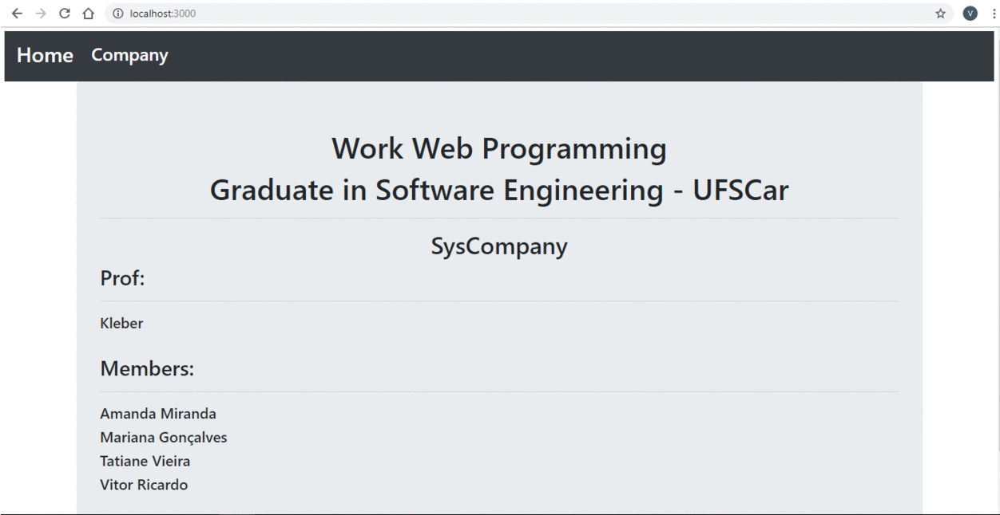

# CRUD NodeJS with MongoDB

## Introduction!
This is a basic CRUD design using NodeJS and MongoDB. We will use the **Express** library to manipulate MongoDB and the **EJS** engine to build the visual layer of our application. 

## Preparation

You need to install [node](http://nodejs.org/), [git](https://git-scm.com/) and [MongoDB](https://www.mongodb.com/download-center/community) locally. 

## Folder Structure

``` bash
├───config
│   └───bd
└───src
    ├───bin
    ├───connection
    ├───controllers
    │   └───company
    ├───public
    │   ├───images
    │   ├───javascripts
    │   └───stylesheets
    ├───repository
    │   └───company
    ├───routes
    │   └───company
    ├───schema
    │   └───company
    └───views
        ├───company
        └───partials
```

## System Flow

<p align="center">
  
</p>

## Getting started
 
 * Go to the folder you installed MongoDB and run the mongod.exe file.

 * Open CMD and execute:
```bash
# clone the project - when cloning the project it will automatically create a folder named crud_nodejs
git clone https://github.com/vitorric/crud_nodejs.git
```
 * Access the folder crud_nodejs, open CMD and execute:
```bash
# install project dependencies
npm install

# install nodemon to start project
npm install -g nodemon

# start project
nodemon
```

Open your browser and enter the URL [http://localhost:3000](http://localhost:3000)

## Connections

Open the **config/bd/index.js** folder, you will see the following JSON:

```js
module.exports = {
    dev: {
        'MONGO_HOST': '127.0.0.1',
        'MONGO_PORT': '27017',
        'MONGO_USER': '',
        'MONGO_PWD': '',
        'MONGO_DB': 'yourDB',
        'MONGO_AUTH_SOURCE': ''
    },
    homolog: {
        'MONGO_HOST': 'ds341825.mlab.com',
        'MONGO_PORT': 41825,
        'MONGO_DB': 'syscompany',
        'MONGO_USER': 'syscompany',
        'MONGO_PWD': 'nahXZB7aGZ4.T<eK'
    }
    ...
};
```

You can configure multiple environments, and to connect to one, just go to the file **src/connection/index.js** and search for the line:

```js
let dbPrincipal = 'dev';
```

```bash
If you change the value of dbPrincipal to homolog, you will get data from a database in mLab. The data inserted in mLab is a json called **company.json**, you can get it in root of project.
```

Change the value **'dev'** to your new environment.

## Demonstration


